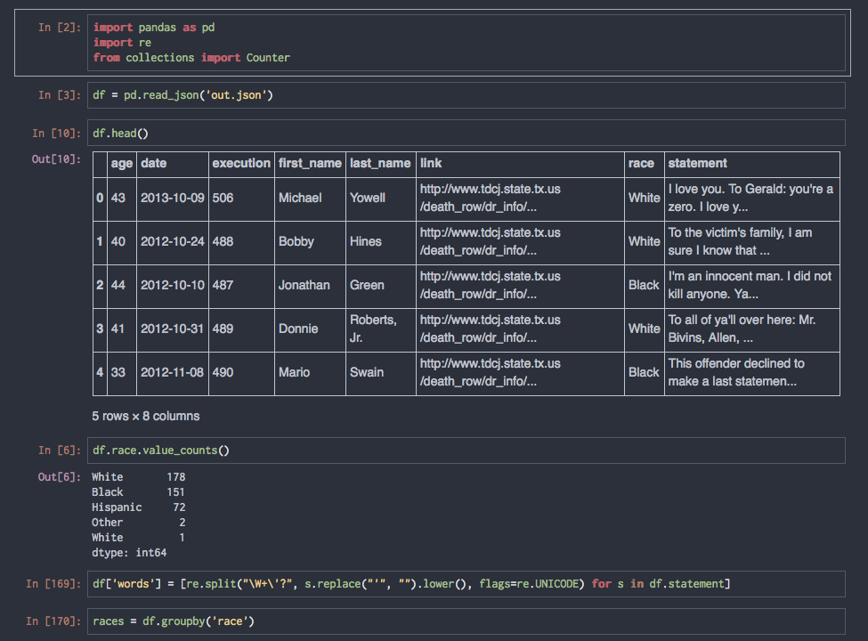
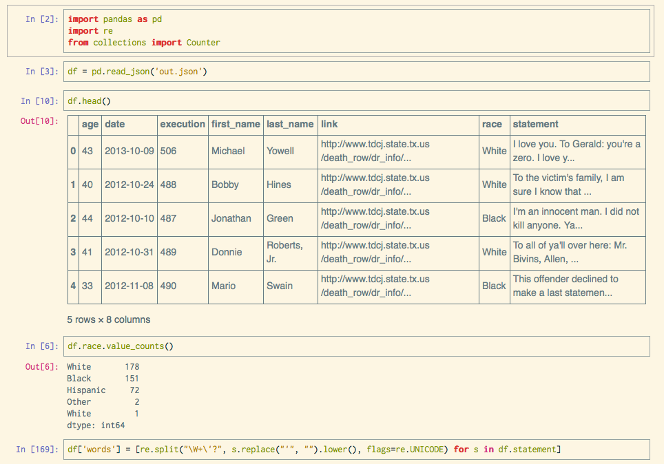

# Base 16 for IPython Notebook

Custom style sheets for [IPython Notebook][1], using Chris Kempson's [Base16][2] color scheme generator

## Screenshots

####Ocean dark



####Solarized light



## Installation

To use these styles, you'll need to place the style sheet of your choice in the static folder for your ipython
profile. If you don't have a custom profile, run:

`ipython profile create <profile-name>`

To locate the directory of your profile, do:

`ipython locate profile <profile-name>`

Your style sheet will need to be named `custom.css` and
placed in the `/static/custom` directory of your profile. So you might grab the `ocean-dark` theme like so:

```sh
wget -O `ipython locate profile <profile-name>`/static/custom/custom.css
https://raw.githubusercontent.com/nsonnad/base16-ipython-notebook/master/base16-ocean-dark.css
```

## What happened to the toolbar?

You will probably notice that the top toolbar is gone in these styles. I've hidden it in the
CSS by default, as I find it mostly useless. If you want it back, just
comment out this line:

``` css
div#maintoolbar, div#header {display: none !important;}
```

## Custom fonts

You can use custom fonts in IPython Notebook by uncommenting a block of code at
the top, eg:

``` css
div#notebook, div.CodeMirror, div.output_area pre, div.output_wrapper, div.prompt {
  font-family: 'Inconsolata', monospace !important;
  font-size: 16px;
}
```

## Credits

* Uses Base16 builder by [Chris Kempson][3].
* Based on [base16-codemirror][4] by [Jan T. Scott][5]

[1]: http://ipython.org/notebook.html
[2]: https://github.com/chriskempson/base16
[3]: https://github.com/chriskempson
[4]: https://github.com/idleberg/base16-codemirror
[5]: https://github.com/idleberg
